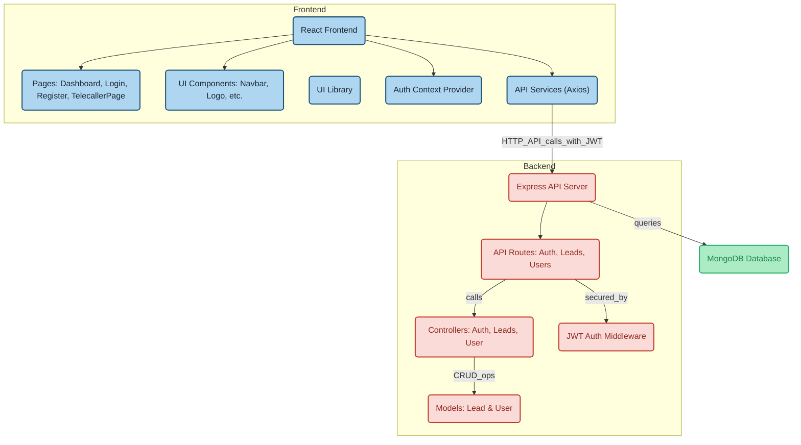

# CRM

A comprehensive Customer Relationship Management (CRM) application with role-based access control, lead management, and call tracking capabilities.

## Features

### User Authentication & Authorization

- Secure JWT-based authentication
- Role-based access control (Admin & Telecaller)
- User registration and login
- Protected routes
- Profile management

### Lead Management

- Create, read, update, and delete leads
- Assign leads to telecallers
- Track lead status and call responses
- Detailed lead information (name, email, phone, address)
- Lead history tracking

### Call Tracking System

- Record call attempts and outcomes
- Multiple call response types:
  - Discussed
  - Callback
  - Interested
  - Busy
  - Ringing No Response (RNR)
  - Switched Off
- Automatic timestamp tracking
- Call history per lead
- Next call scheduling

### Dashboard & Analytics

- Real-time statistics:
  - Total telecallers
  - Total leads
  - Connected calls
  - Conversion rates
- Call trends visualization (7-day chart)
- Detailed call records table
- Color-coded status indicators
- Performance metrics

### User Management

- Admin can view all leads and telecallers
- Telecallers can manage their assigned leads
- Profile management
- Role-based permissions
- User activity tracking

## System Architecture & Workflow



### Key Features of the Architecture

#### Frontend Layer

- **React Frontend**: Core application built with React
- **Pages**: Main application views including Dashboard, Login, Register, and TelecallerPage
- **UI Components**: Reusable components for consistent user interface
- **UI Library**: Comprehensive component library for enhanced design
- **Auth Context**: Global state management for authentication
- **API Services**: Axios-based service layer for backend communication

#### Backend Layer

- **Express Server**: RESTful API server built with Express.js
- **API Routes**: Organized endpoints for Auth, Leads, and Users
- **Controllers**: Business logic implementation
- **JWT Middleware**: Security layer for route protection
- **Models**: Mongoose schemas for data structure

#### Database Layer

- **MongoDB**: NoSQL database for flexible data storage
- **Mongoose ODM**: Object Data Modeling for MongoDB

#### Interactive Features

- All components in the diagram are clickable and link to their respective source code
- Color-coded sections for easy visualization:
  - Frontend (Blue)
  - Backend (Red)
  - Database (Green)

## Tech Stack

### Backend

- Node.js
- Express.js
- MongoDB
- JWT for authentication
- Bcrypt for password hashing
- Express Validator for input validation
- Mongoose for database operations

### Frontend

- React
- Material-UI
- React Router
- Chart.js for analytics
- Axios for API calls
- Context API for state management
- Vite for build tooling

## Prerequisites

- Node.js (v14 or higher)
- MongoDB
- npm or yarn

## Installation

1. Clone the repository:

```bash
git clone <repository-url>
cd insurance-lab
```

2. Install backend dependencies:

```bash
cd backend
npm install
```

3. Install frontend dependencies:

```bash
cd ../frontend
npm install
```

4. Create a `.env` file in the backend directory:

```env
PORT=5000
MONGODB_URI=mongodb://localhost:27017/insurance-lab
JWT_SECRET=your_jwt_secret
```

5. Create a `.env` file in the frontend directory:

```env
VITE_API_URL=http://localhost:5000/api
```

## Running the Application

1. Start the backend server:

```bash
cd backend
npm run dev
```

2. Start the frontend development server:

```bash
cd frontend
npm run dev
```

The application will be available at:

- Frontend: http://localhost:5173
- Backend: http://localhost:5000

## API Endpoints

### Authentication

- `POST /api/auth/register` - Register a new user
- `POST /api/auth/login` - Login user
- `GET /api/auth/me` - Get current user
- `GET /api/auth/profile` - Get user profile

### Leads

- `GET /api/leads` - Get all leads
- `POST /api/leads` - Create a new lead
- `PUT /api/leads/:id` - Update a lead
- `DELETE /api/leads/:id` - Delete a lead
- `PUT /api/leads/:id/status` - Update lead status
- `PUT /api/leads/:id/call-response` - Update call response

### Dashboard

- `GET /api/dashboard/stats` - Get dashboard statistics
- `GET /api/leads/connected` - Get connected calls
- `GET /api/dashboard/trends` - Get call trends

## User Roles

### Admin

- View all leads and telecallers
- Create and manage leads
- View dashboard statistics
- Manage user accounts
- Delete leads
- Access all features

### Telecaller

- View assigned leads
- Update lead status and call responses
- View personal dashboard
- Update profile information
- Track call history

## Project Structure

### Backend

```
backend/
├── controller/     # Route controllers
├── middleware/     # Custom middleware
├── models/         # Database models
├── routes/         # API routes
├── server.js       # Main application file
└── .env            # Environment variables
```

### Frontend

```
frontend/
├── src/
│   ├── components/     # Reusable UI components
│   ├── pages/         # Page components
│   ├── context/       # React context providers
│   ├── hooks/         # Custom React hooks
│   ├── services/      # API service functions
│   ├── utils/         # Utility functions
│   ├── assets/        # Static assets
│   └── App.jsx        # Main application component
├── public/            # Public assets
└── vite.config.js     # Vite configuration
```

## Contributing

1. Fork the repository
2. Create your feature branch (`git checkout -b feature/amazing-feature`)
3. Commit your changes (`git commit -m 'Add some amazing feature'`)
4. Push to the branch (`git push origin feature/amazing-feature`)
5. Open a Pull Request

## Development Guidelines

### Backend

- Follow RESTful API design principles
- Implement proper error handling
- Use middleware for common functionality
- Write clean, maintainable code
- Add appropriate comments and documentation

### Frontend

- Follow React best practices
- Use functional components with hooks
- Implement proper error handling
- Write clean, maintainable code
- Add appropriate comments and documentation

## License

This project is licensed under the MIT License - see the [LICENSE](LICENSE) file for details.
